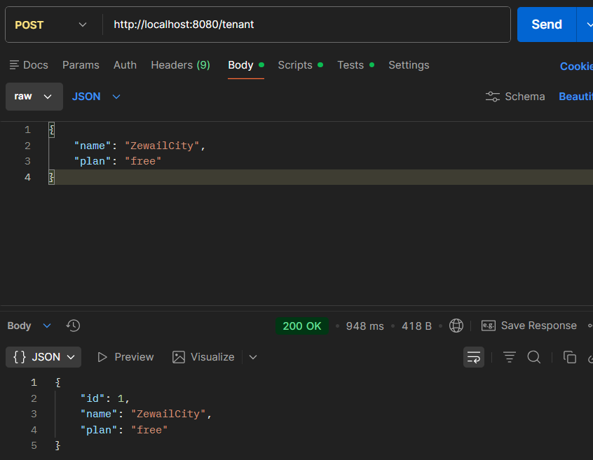
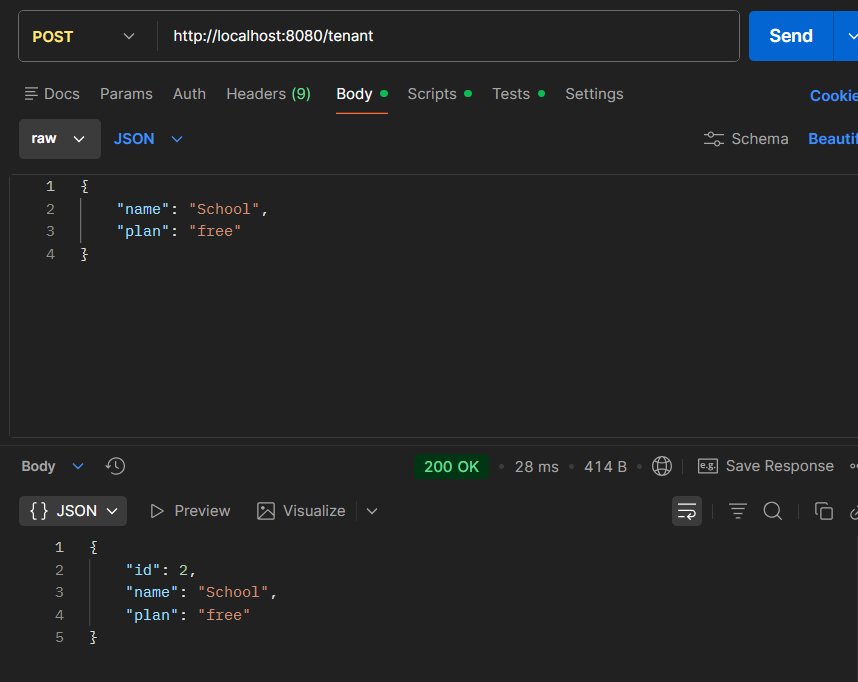
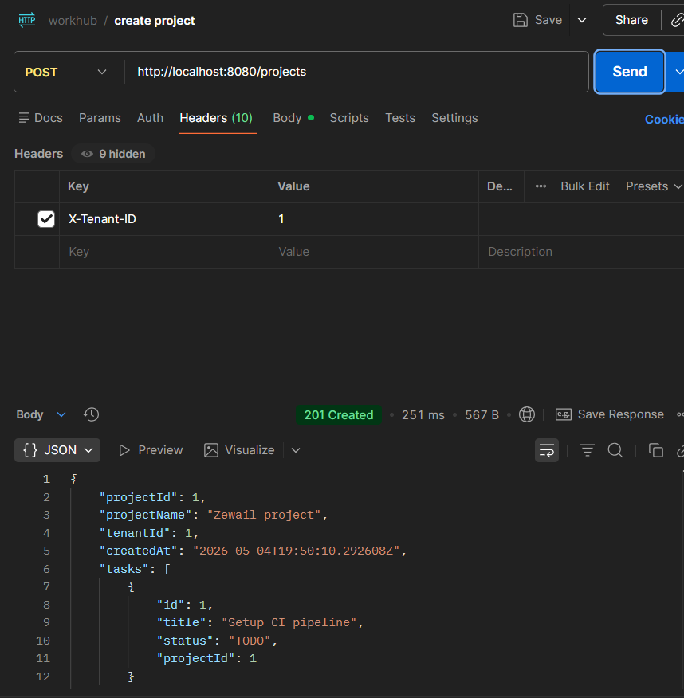
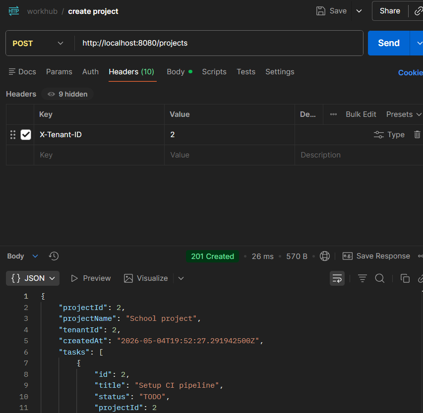
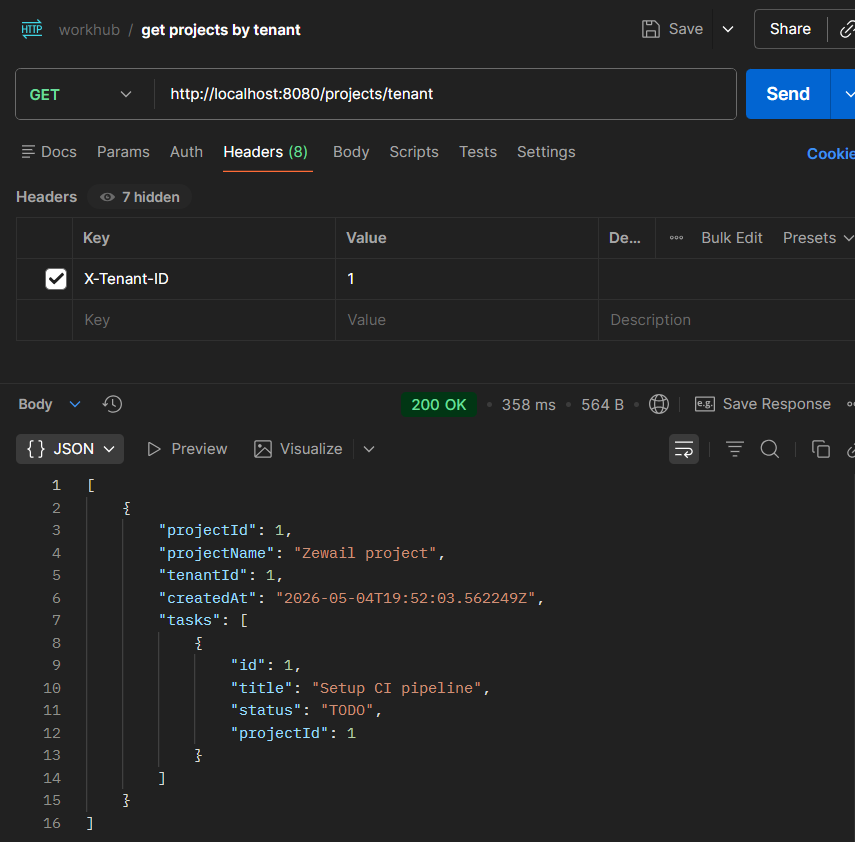
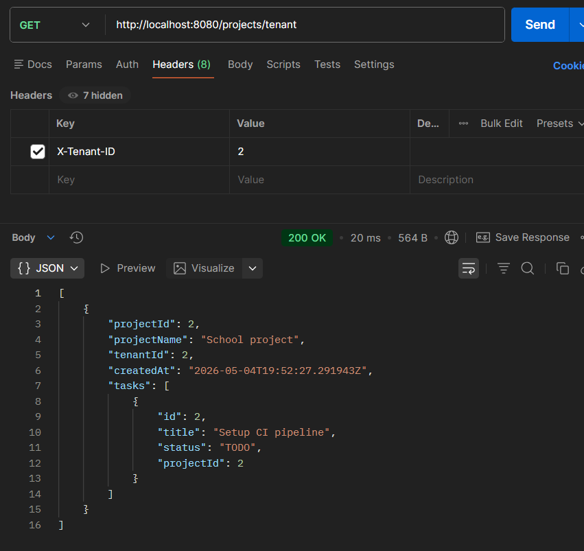

# Tenant Isolation (Created Using Discriminator Column)

## Step 1 — Create TenantContext

Store the current tenant ID per thread using ThreadLocal

```java
public class TenantContext {
    private static final ThreadLocal<Long> currentTenant = new ThreadLocal<>();

    public static void setTenantId(Long tenantId) { currentTenant.set(tenantId); }
    public static Long getTenantId() { return currentTenant.get(); }
    public static void clear() { currentTenant.remove(); }
}
```

**Expected Result:**
- Each request thread holds its own isolated tenant ID.
- No tenant ID leaks between concurrent requests.

---

## Step 2 — Create TenantAwareEntity Base Class

All tenant-scoped entities inherit tenant_id and auto-population logic from this superclass.

```java
@MappedSuperclass
@FilterDef(name = "tenantFilter", parameters = @ParamDef(name = "tenantId", type = Long.class))
public abstract class TenantAwareEntity {

    @Column(name = "tenant_id", nullable = false, updatable = false)
    private Long tenantId;

    @PrePersist
    public void prePersist() {
        if (this.tenantId == null) {
            this.tenantId = TenantContext.getTenantId();
        }
    }

    public Long getTenantId() { return tenantId; }
    public void setTenantId(Long tenantId) { this.tenantId = tenantId; }
}
```

**Expected Result:**
- Every entity that extends this class gets a tenant_id column in the database.
- On insert, tenant_id is automatically populated from TenantContext, no manual setting required.
- @FilterDef is declared once here and shared by all child entities.

---

## Step 3 — Apply @Filter on Each Entity

Each entity declares the filter condition. @FilterDef is inherited from the superclass.

```java
@Entity
@Table(name = "projects", uniqueConstraints = {
        @UniqueConstraint(columnNames = {"name", "tenant_id"})
})
@Filter(name = "tenantFilter", condition = "tenant_id = :tenantId")
public class Project extends TenantAwareEntity {

    @Id
    @GeneratedValue(strategy = GenerationType.IDENTITY)
    private Long id;

    private String name;

    @PrePersist
    void onCreate() {
        this.createdAt = Instant.now();
        super.prePersist();
    }
}
```

**Expected Result:**
- When the Hibernate filter is active, all SELECT queries on this entity automatically append WHERE tenant_id = ?

---

## Step 4 — Create TenantFilter 

Intercept every HTTP request, extract the tenant ID from the header, and store it in TenantContext

```java
@Component
@Order(1)
public class TenantFilter implements Filter {

    @Override
    public void doFilter(ServletRequest req, ServletResponse res, FilterChain chain)
            throws IOException, ServletException {

        HttpServletRequest request = (HttpServletRequest) req;
        String tenantIdHeader = request.getHeader("X-Tenant-ID");

        if (request.getRequestURI().startsWith("/tenant") ||
            request.getRequestURI().startsWith("/swagger-ui") ||
            request.getRequestURI().startsWith("/v3/api-docs")) {
            chain.doFilter(req, res);
            return;
        }

        if (tenantIdHeader == null || tenantIdHeader.isBlank()) {
            ((HttpServletResponse) res).sendError(400, "Missing tenant ID");
            return;
        }

        try {
            TenantContext.setTenantId(Long.valueOf(tenantIdHeader));
        } catch (NumberFormatException e) {
            ((HttpServletResponse) res).sendError(400, "Invalid tenant ID — must be a number");
            return;
        }

        try {
            chain.doFilter(req, res);
        } finally {
            TenantContext.clear(); 
        }
    }
}
```

**Expected Result:**
- Requests without X-Tenant-ID header receive 400 Bad Request.
- Requests with a non-numeric tenant ID receive 400 Bad Request.
- Valid requests have their tenant ID stored in TenantContext for the duration of the request.
- Public endpoints (`/tenant`, `/swagger-ui`, `/v3/api-docs`) bypass the filter entirely.

---


## Evidence from Postman


In the above two screenshots, two tenants have been created in the system ZewailCity and School
---

Zewail project is added for the ZewailCity tenant, where X-Tenant-ID=1
---

School project is added for School, where the X-Tenant-ID=2
---


The above screenshots showcase successful tenant isolation, where tenant 1's project are not accessible to tenant 2 and vice versa.
